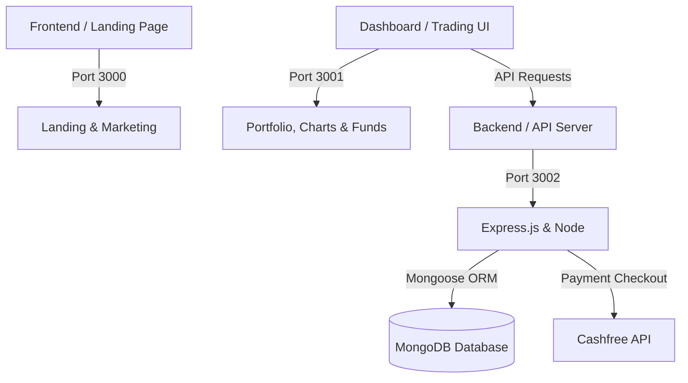
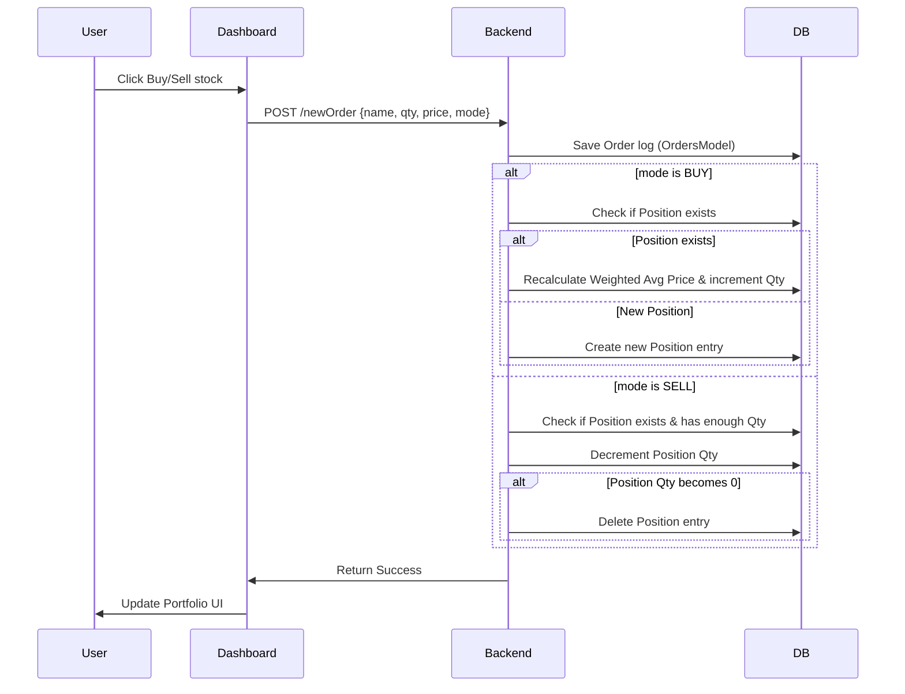
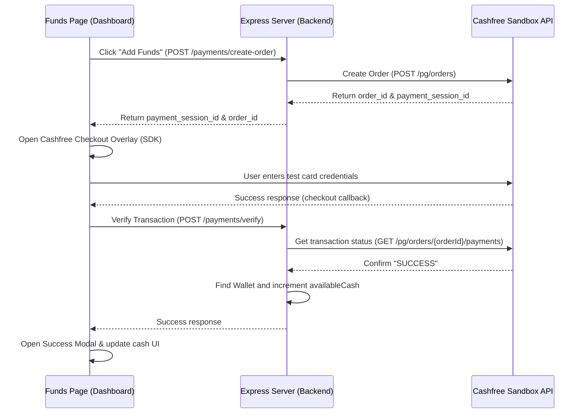

# 🎓 Investix – Learner's Guide & Project Walkthrough

Welcome to **Investix**! This guide is designed to help you understand the architecture, data flow, database schemas, and external integrations of this fintech-grade stock simulation and portfolio management system.

---

## 🗺 System Architecture Overview

Investix is divided into three core subsystems, each playing a specific role:

1.  **Frontend (Landing Page):** A static marketing site detailing product features, pricing, support, and and signup landing pages.
2.  **Dashboard (Trading UI):** The main trading application where users view their portfolio, track stock prices, execute buy/sell simulated orders, and add virtual funds.
3.  **Backend (API Server):** A RESTful Node.js and Express API server connected to a MongoDB database. Handles transactions, calculates weighted averages, and integrates Cashfree Payment Gateway.

---

## 🗄 Database Models & Schemas

The database layer uses **Mongoose (MongoDB)** to enforce schema rules. Under `backend/model/`, you will find four primary models:

### 1. `Wallet` ([WalletModel.js](file:///d:/Investex/Investix/backend/model/WalletModel.js))
Tracks the user's available virtual cash.
*   `userId` (String, Unique): Identifies the account holder.
*   `availableCash` (Number, Default: `0`): Cash available for buying stocks.

### 2. `Holdings` ([HoldingsModel.js](file:///d:/Investex/Investix/backend/model/HoldingsModel.js))
Represents long-term investments (delivery trades).
*   `name` (String): Ticker symbol of the stock (e.g., `INFY`).
*   `qty` (Number): Quantity owned.
*   `avg` (Number): Average buy price.
*   `price` (Number): Current Last Traded Price (LTP).
*   `net` (String): Net percentage change (e.g. `+15.18%`).
*   `day` (String): Price change percentage today.

### 3. `Positions` ([PositionsModel.js](file:///d:/Investex/Investix/backend/model/PositionsModel.js))
Represents active, short-term trades (intraday / open derivatives positions).
*   `product` (String): Type of trade (e.g., `CNC` - Cash & Carry).
*   `name` (String): Ticker symbol of the stock.
*   `qty` (Number): Active position quantity.
*   `avg` (Number): Average purchase price.
*   `price` (Number): Current market price.
*   `isLoss` (Boolean): Flag representing if the position is currently in a loss.

### 4. `Orders` ([OrdersModel.js](file:///d:/Investex/Investix/backend/model/OrdersModel.js))
Stores historical logs of all trades.
*   `name` (String): Stock symbol.
*   `qty` (Number): Ordered quantity.
*   `price` (Number): Execution price.
*   `mode` (String): Buy or Sell (`BUY` / `SELL`).

---

## 🔄 Core Business Logic Flows

### 📈 Executing a New Order (`POST /newOrder`)
When a user buys or sells a stock from the WatchList, the backend updates the order logs and recalculates active positions:

*   **Weighted Average Price calculation:** If a user already owns 10 shares of `ITC` at ₹200 and buys 5 more at ₹215:
    $$\text{New Average} = \frac{(10 \times 200) + (5 \times 215)}{10 + 5} = \text{₹}205$$

---

## 💳 Payment Gateway Integration (Cashfree)

The "Funds" page integrates Cashfree's PG API to let users load virtual cash:

---

## 🧠 Code Exploration Walkthroughs

### 1. WatchList and Interactive Charts
*   Files: [WatchList.js](file:///d:/Investex/Investix/dashboard/src/components/WatchList.js), [DoughnoutChart.js](file:///d:/Investex/Investix/dashboard/src/components/DoughnoutChart.js)
*   **Concept:** Uses local mock data in `data.js` to render the stock list. When hovered, action menus (Buy / Sell) appear. It renders a Chart.js Doughnut chart to visualize the portfolio asset allocation distribution based on price.

### 2. Buying Stocks
*   Files: [BuyActionWindow.js](file:///d:/Investex/Investix/dashboard/src/components/BuyActionWindow.js)
*   **Concept:** Collects inputs for target quantity, price, and type of order. Once clicked, it makes an HTTP POST request to the backend `/newOrder` endpoint and closes the action modal.

---

## 🚀 Recommended Exercises for Learners

To deepen your understanding, try adding these features to the codebase:

1.  **Add User Authentication:**
    Implement session or JWT-based login using the commented/provided Passport.js dependencies in the backend. Protect the dashboard routes.
2.  **Live Market Price Feeds:**
    Replace the static mock stock values in `WatchList.js` with live updates using a free financial API (such as Finnhub or Alpha Vantage) using WebSockets or periodic polling.
3.  **Real Wallet Deductions:**
    Modify the `/newOrder` route in the backend to check if the user has enough `availableCash` in their wallet before executing a `BUY` order. Deduct the cost upon execution.
